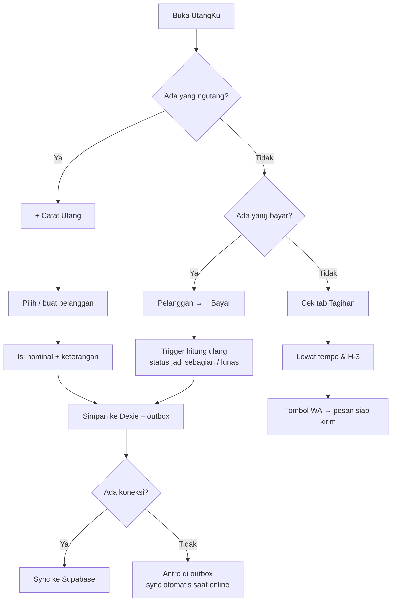

# UtangKu — Rencana Pembangunan

> Aplikasi pencatatan utang pelanggan untuk warung, warteg, dan warkop.
> Dokumen ini adalah **perencanaan**, bukan kode. Build dimulai setelah dokumen ini direview dan disetujui.

- **Versi dokumen:** 1.0
- **Tanggal:** 24 Agustus 2026
- **Repo:** `hendri01jkt-oss/Utangku`
- **Status:** Menunggu review — belum ada baris kode yang ditulis

---

## Daftar Isi

1. [Ringkasan Project](#0-ringkasan-project)
2. [Tech Stack Final](#1-tech-stack-final)
3. [Struktur Database Supabase](#2-struktur-database-supabase)
4. [Daftar Halaman / Screen](#3-daftar-halaman--screen)
5. [Fitur MVP vs Fase 2 + Urutan Pembangunan](#4-fitur-mvp-vs-fase-2--urutan-pembangunan)
6. [Alur Penggunaan (User Flow)](#5-alur-penggunaan-user-flow)
7. [Autentikasi & Multi-Tenant](#6-autentikasi--multi-tenant)
8. [Arsitektur Offline-First & Sync](#7-arsitektur-offline-first--sync)
9. [Design System](#8-design-system)
10. [Risiko & Keputusan Terbuka](#9-risiko--keputusan-terbuka)

---

## 0. Ringkasan Project

**Masalah.** Pemilik warung mencatat utang pelanggan di buku tulis. Bukunya bisa hilang atau basah, tulisannya sulit dibaca setelah beberapa bulan, merekap total piutang berarti menjumlah manual satu per satu, dan menagih mengandalkan ingatan — "kayaknya Bu Siti belum bayar" bukan dasar yang enak untuk menagih orang.

**Solusi.** UtangKu adalah PWA yang menggantikan buku utang: catat utang dalam hitungan detik, terima cicilan, lihat sisa utang per pelanggan dan total keseluruhan, tahu persis siapa yang jatuh tempo, dan kirim tagihan WhatsApp yang sopan dengan sekali klik.

**Target pengguna.** Pemilik warung/warteg/warkop di Indonesia. HP Android kelas menengah-bawah, sinyal sering putus-putus, dipakai sambil melayani pembeli — sering satu tangan.

**Tiga prinsip produk** yang dipakai untuk memutuskan hal-hal teknis di dokumen ini:

1. **Offline dulu.** Aplikasi harus jalan penuh tanpa sinyal. Sinkronisasi adalah urusan aplikasi, bukan urusan pemilik warung.
2. **Cepat dipakai satu tangan.** Mencatat satu utang ditargetkan di bawah 15 detik. Setiap field tambahan harus membayar dirinya sendiri.
3. **Angka Rupiah tidak pernah salah.** Uang orang lain dicatat di sini. Tidak boleh ada pembulatan aneh, sisa utang yang tidak cocok, atau cicilan yang hilang saat sinkron.

---

## 1. Tech Stack Final

| Lapisan | Pilihan | Alasan |
|---|---|---|
| Framework | **React 19 + Vite 6 + TypeScript** (strict) | Sesuai rencana awal, konsisten dengan AwetKu/GudangKu |
| Styling | **Tailwind CSS v4** + CSS variables untuk token navy/gold | Glassmorphism butuh layer transparan + `backdrop-blur` yang konsisten di semua kartu |
| Routing | **React Router v7** | Cukup untuk SPA; tidak butuh SSR |
| State data | **`dexie-react-hooks` (`useLiveQuery`)** — *tanpa TanStack Query* | Sumber data adalah IndexedDB lokal, bukan network. Menambah query-cache di atas database lokal hanya menambah lapisan yang membingungkan |
| State UI/sesi | **Zustand** (store kecil: sesi, warung aktif, status sync) | Ringan, tanpa boilerplate |
| Database lokal | **Dexie 4** (IndexedDB) | Sumber kebenaran saat offline |
| PWA | **`vite-plugin-pwa`** (Workbox) | Manifest, precache app shell, prompt update |
| Backend | **Supabase** — Postgres + Auth + Storage + Edge Functions + `pg_cron` | Sesuai rencana awal |
| Hosting | **Netlify** (static + `_redirects` SPA fallback) | Sesuai rencana awal |
| Serverless | **Supabase Edge Functions**, *bukan* Netlify Functions | Cron harian & webhook pembayaran butuh akses DB dengan service role — lebih dekat dan lebih aman dijalankan di Supabase. Netlify cukup jadi CDN statis |
| Export PDF | `jspdf` + `jspdf-autotable` | Jalan penuh di browser, jadi export tetap bisa saat offline |
| Export Excel | `xlsx` (SheetJS community) | Menghasilkan `.xlsx` langsung dari browser |
| Tanggal | `date-fns` + locale `id` | Format "24 Agu 2026", hitung H-3 |
| Uang | `Intl.NumberFormat('id-ID')` — **tanpa library** | Lihat aturan uang di bawah |
| Ikon | `lucide-react` | Ringan, konsisten |
| Testing | **Vitest** + Testing Library | Fokus pada logika hitung utang & sync engine — bukan snapshot semua komponen |
| APK | **Fase 2** — Capacitor + GitHub Actions (`assembleRelease`), atau TWA via Bubblewrap | PWA dulu. GitHub Actions hanya dipasang kalau benar-benar mau masuk Play Store |

### Aturan Uang (non-negosiasi)

Ini ditulis eksplisit karena satu bug di sini merusak kepercayaan pada seluruh aplikasi:

- Nominal disimpan sebagai **rupiah penuh bilangan bulat** — bukan sen, bukan float. Kolom `numeric(14,2)` di Postgres, `number` bulat di TypeScript.
- **Tidak ada aritmatika floating point pada uang.** Penjumlahan cicilan dilakukan pada bilangan bulat.
- Tampilan lewat satu util terpusat, tidak pernah format manual di komponen.
- Input pakai komponen `<InputRupiah>` bermask ribuan yang menyimpan angka mentah ke state.

```ts
// src/lib/uang.ts — satu-satunya tempat format uang
export const formatRupiah = (n: number) =>
  new Intl.NumberFormat('id-ID', {
    style: 'currency', currency: 'IDR', maximumFractionDigits: 0,
  }).format(n);                        // 1500000 -> "Rp 1.500.000"

export const parseRupiah = (s: string) => Number(s.replace(/\D/g, '')) || 0;
export const terbilang = (n: number) => { /* untuk footer PDF */ };
```

### Struktur Folder

```
src/
  app/          router, layout shell, providers, guard auth
  fitur/        pelanggan/ utang/ pembayaran/ laporan/ tagihan/ pengaturan/
  komponen/     ui/ (Kartu, Tombol, InputRupiah, BottomSheet, StatusBadge, ...)
  data/
    db.ts       skema Dexie
    repo/       repositori per entitas (satu-satunya pintu ke data)
    sync/       sync engine + outbox
  lib/          uang.ts, tanggal.ts, wa.ts, supabase.ts
  gaya/         tokens.css, glass.css
supabase/
  migrations/   SQL bernomor
  functions/    edge functions
```

**Aturan arsitektur paling penting:** komponen UI **tidak pernah** memanggil Supabase langsung. Semua lewat `data/repo/*`, yang menulis ke Dexie. Ini yang membuat sifat offline-first tidak bocor sedikit demi sedikit begitu fitur bertambah.

---

## 2. Struktur Database Supabase

Konvensi mengikuti project **AwetKu** yang sudah ada: nama kolom Bahasa Indonesia, PK `uuid`, enum Postgres bernama, RLS aktif di semua tabel, foto disimpan sebagai path Storage.

### 2.1 Enum

| Enum | Nilai |
|---|---|
| `warung_role` | `pemilik`, `kasir` |
| `pelanggan_status` | `aktif`, `nonaktif` |
| `utang_status` | `belum_lunas`, `sebagian`, `lunas` |
| `metode_bayar` | `tunai`, `transfer`, `qris`, `lainnya` |
| `subscription_tier` | `free`, `pro` |
| `subscription_status` | `active`, `expired`, `cancelled` |
| `payment_status` | `pending`, `settlement`, `expired`, `failed` |

### 2.2 Tabel

#### `profiles`
Identitas orang (bukan warung). Dibuat otomatis oleh trigger saat user mendaftar.

| Kolom | Tipe | Ket. |
|---|---|---|
| `id` | `uuid` PK | → `auth.users.id` |
| `nama_lengkap` | `text` | |
| `no_wa` | `text` | nullable |
| `created_at` / `updated_at` | `timestamptz` | default `now()` |

#### `warung` — tenant
| Kolom | Tipe | Ket. |
|---|---|---|
| `id` | `uuid` PK | `gen_random_uuid()` |
| `pemilik_id` | `uuid` | → `auth.users.id` |
| `nama_warung` | `text` NOT NULL | |
| `alamat` | `text` | nullable |
| `no_wa_warung` | `text` | nullable |
| `logo_path` | `text` | path Storage, nullable |
| `template_pesan_tagihan` | `text` | template WA, ada default |
| `tempo_default_hari` | `int` default `0` | 0 = tanpa tempo |
| `created_at` / `updated_at` | `timestamptz` | |

#### `warung_anggota` — kunci isolasi data
| Kolom | Tipe | Ket. |
|---|---|---|
| `warung_id` | `uuid` | → `warung.id` |
| `user_id` | `uuid` | → `auth.users.id` |
| `role` | `warung_role` | default `pemilik` |
| `created_at` | `timestamptz` | |
| | | **PK gabungan (`warung_id`, `user_id`)** |

Di MVP tabel ini hanya berisi satu baris per warung (`pemilik`), dibuat otomatis saat onboarding. **Semua policy RLS membaca dari tabel ini** — sehingga menambah kasir di fase 2 cukup `insert` satu baris, tanpa perubahan skema dan tanpa migrasi data.

#### `pelanggan`
| Kolom | Tipe | Ket. |
|---|---|---|
| `id` | `uuid` PK | dibuat di client |
| `warung_id` | `uuid` | → `warung.id` |
| `nama` | `text` NOT NULL | |
| `no_wa` | `text` | nullable — dinormalisasi ke format `628...` |
| `alamat` | `text` | nullable |
| `foto_path` | `text` | nullable |
| `catatan` | `text` | nullable |
| `status` | `pelanggan_status` | default `aktif` |
| `created_at` / `updated_at` | `timestamptz` | |
| `deleted_at` | `timestamptz` | soft delete |

Index: `(warung_id, nama)`.

#### `transaksi_utang`
| Kolom | Tipe | Ket. |
|---|---|---|
| `id` | `uuid` PK | dibuat di client |
| `warung_id` | `uuid` | → `warung.id` |
| `pelanggan_id` | `uuid` | → `pelanggan.id` |
| `tanggal` | `date` NOT NULL | default hari ini |
| `nominal` | `numeric(14,2)` NOT NULL | |
| `keterangan` | `text` | mis. "nasi + es teh" |
| `jatuh_tempo` | `date` | nullable — kalau warung kasih tempo |
| `status` | `utang_status` | default `belum_lunas` — **diisi trigger, bukan client** |
| `total_dibayar` | `numeric(14,2)` | default `0` — **diisi trigger** |
| `reminder_hari_sebelum` | `int` | default `3` |
| `reminder_terkirim_untuk` | `date` | nullable — penanda idempoten |
| `dibuat_oleh` | `uuid` | untuk fase 2 multi-kasir |
| `created_at` / `updated_at` / `deleted_at` | `timestamptz` | |

Index: `(warung_id, pelanggan_id, status)`, dan `(warung_id, jatuh_tempo) where deleted_at is null`.

#### `pembayaran`
| Kolom | Tipe | Ket. |
|---|---|---|
| `id` | `uuid` PK | dibuat di client |
| `warung_id` | `uuid` | → `warung.id` |
| `transaksi_id` | `uuid` | → `transaksi_utang.id` |
| `pelanggan_id` | `uuid` | **didenormalisasi** agar riwayat per pelanggan tidak perlu join |
| `tanggal` | `date` NOT NULL | |
| `nominal` | `numeric(14,2)` NOT NULL | |
| `metode` | `metode_bayar` | default `tunai` |
| `catatan` | `text` | nullable |
| `dibuat_oleh` | `uuid` | |
| `created_at` / `updated_at` / `deleted_at` | `timestamptz` | |

#### `subscriptions` — dibuat sejak MVP, belum ditegakkan
| Kolom | Tipe | Ket. |
|---|---|---|
| `warung_id` | `uuid` PK | → `warung.id` |
| `tier` | `subscription_tier` | default `free` |
| `status` | `subscription_status` | default `active` |
| `tanggal_mulai_langganan` | `timestamptz` | nullable |
| `tanggal_expired` | `timestamptz` | nullable |
| `payment_provider` | `text` | nullable |
| `payment_reference` | `text` | nullable |
| `updated_at` | `timestamptz` | |

Tabelnya dibuat sejak awal (semua warung `free`) supaya fase 2 tidak perlu backfill. **Tidak ada limit apa pun yang ditegakkan di MVP.**

#### `payment_orders` — **fase 2**
Salinan struktur AwetKu: `order_id text PK`, `warung_id`, `amount`, `status payment_status`, `midtrans_transaction_id`, `created_at`, `updated_at`.

#### `transaksi_item` — **fase 2**
`id`, `transaksi_id`, `nama_item`, `qty`, `harga_satuan`, `subtotal`.

> **Keputusan sadar:** di MVP rincian item cukup ditulis sebagai teks bebas di `keterangan`. Memaksa pemilik warung mengetik 5 baris item per utang sambil melayani pembeli adalah cara tercepat membuat aplikasi ini ditinggalkan. Tabel ini ditambahkan nanti kalau memang ada permintaan nyata.

### 2.3 Relasi

```
auth.users ─1:1─ profiles
auth.users ─1:N─ warung_anggota ─N:1─ warung
warung ─1:N─ pelanggan ─1:N─ transaksi_utang ─1:N─ pembayaran
warung ─1:1─ subscriptions
warung ─1:N─ transaksi_utang / pembayaran   (warung_id di setiap baris)
```

### 2.4 Trigger: status utang adalah hasil hitungan, bukan input

```sql
-- AFTER INSERT / UPDATE / DELETE pada pembayaran
create function fn_hitung_ulang_utang() returns trigger ...
-- 1. total_dibayar = SUM(nominal) pembayaran yang deleted_at is null
-- 2. status = 'lunas'       bila total_dibayar >= nominal
--           = 'sebagian'    bila total_dibayar > 0
--           = 'belum_lunas' selain itu
```

**Client tidak pernah menulis `status` atau `total_dibayar`.** Keduanya selalu turunan dari tabel `pembayaran`. Ini yang mencegah kasus "tertulis lunas padahal masih ada sisa" — kasus yang paling merusak kepercayaan pada aplikasi pencatat utang.

### 2.5 View

**`v_ringkasan_pelanggan`** — per pelanggan: `total_utang`, `total_dibayar`, `sisa_utang`, `jumlah_transaksi_aktif`, `jatuh_tempo_terdekat`, `tanggal_utang_terlama`.

**`v_ringkasan_warung`** — per warung: `total_piutang`, `jumlah_pelanggan_berutang`, `tertagih_bulan_ini`, `jumlah_jatuh_tempo_3_hari`, `jumlah_lewat_tempo`.

> Catatan: view dipakai untuk laporan dan verifikasi. Ringkasan yang tampil di layar dihitung **dari Dexie**, supaya angka tetap muncul saat offline.

### 2.6 Row Level Security — satu pola untuk semua tabel

```sql
create function public.warung_saya() returns setof uuid
  language sql security definer stable set search_path = public as $$
    select warung_id from warung_anggota where user_id = auth.uid()
  $$;

-- Pola yang sama diterapkan ke pelanggan, transaksi_utang,
-- pembayaran, subscriptions, payment_orders:
create policy "akses warung sendiri" on <tabel> for all
  using      (warung_id in (select public.warung_saya()))
  with check (warung_id in (select public.warung_saya()));
```

- `profiles`: `id = auth.uid()`
- `warung` dan `warung_anggota`: lewat keanggotaan user
- Fungsi `security definer` dipakai supaya policy tidak rekursif dan tetap cepat (hasilnya di-cache per statement)

**RLS aktif di semua tabel.** Isolasi antar warung dijamin oleh Postgres, bukan oleh kode UI — sehingga bug di frontend tidak bisa membocorkan data warung lain.

### 2.7 Storage

| Bucket | Privat | Struktur path |
|---|---|---|
| `foto-pelanggan` | ya | `{warung_id}/{pelanggan_id}.jpg` |
| `logo-warung` | ya | `{warung_id}/logo.jpg` |

Policy Storage mencocokkan segmen pertama path terhadap `warung_saya()`. Foto di-resize di client ke sisi terpanjang ≤512px sebelum upload — hemat kuota dan jauh lebih cepat di sinyal lemah.

### 2.8 Migrasi

File SQL bernomor di `supabase/migrations/`, diterapkan lewat Supabase MCP (`apply_migration`). Tipe TypeScript di-generate ke `src/data/database.types.ts` dan di-commit.

---

## 3. Daftar Halaman / Screen

| Route | Nama | Isi inti |
|---|---|---|
| `/masuk` | Masuk | Email + password, tombol "Masuk dengan Google", link lupa password |
| `/daftar` | Daftar | Buat akun → lanjut ke onboarding |
| `/lupa-password`, `/reset-password` | Reset Password | Alur email bawaan Supabase |
| `/onboarding` | Setup Warung | Nama warung, no WA, logo, tempo default → membuat `warung` + `warung_anggota` + `subscriptions` |
| `/` | **Beranda** | Kartu: Total Piutang · Pelanggan Berutang · Tertagih Bulan Ini. Daftar "Perlu Ditagih" (lewat tempo dulu, lalu H-3). FAB "+ Catat Utang". Indikator status sync |
| `/pelanggan` | Daftar Pelanggan | Cari nama/no WA; urut sisa utang terbesar atau utang terlama; badge sisa utang tiap baris |
| `/pelanggan/baru` · `/pelanggan/:id/ubah` | Form Pelanggan | Nama (wajib), no WA, foto opsional (kamera/galeri), alamat, catatan |
| `/pelanggan/:id` | **Detail Pelanggan** | Foto + nama, sisa utang besar di atas, tombol **Tagih via WA** · **+ Utang** · **+ Bayar**. Tab: Riwayat Utang / Riwayat Pembayaran |
| `/utang/baru` | Catat Utang | Pelanggan (pilih cepat / buat baru inline), nominal, tanggal (default hari ini), keterangan, jatuh tempo opsional |
| `/utang/:id` | Detail Utang | Nominal, sisa, progress cicilan, riwayat pembayaran, tombol Bayar, ubah/hapus |
| `/utang/:id/bayar` | Bayar *(bottom sheet)* | Nominal (tombol cepat **Lunasi Semua**), tanggal, metode, catatan |
| `/tagihan` | **Perlu Ditagih** | Grup: Lewat Tempo · Jatuh Tempo H-3 · Utang Terlama. Tiap baris punya tombol WA |
| `/laporan` | Laporan | Filter periode (bulan ini / bulan lalu / custom), ringkasan, tabel transaksi & pembayaran, tombol **Export PDF** dan **Export Excel** |
| `/pengaturan` | Pengaturan | Profil warung, template pesan WA, tempo default, status sync + "Sinkron Sekarang", tema, keluar |
| `/pengaturan/langganan` | Langganan | **Fase 2** |

**Navigasi:** bottom tab bar 4 item — **Beranda · Pelanggan · Tagihan · Laporan** — dengan badge angka di Tagihan. Semua aksi utama berada dalam jangkauan jempol; tidak ada aksi penting di pojok atas layar.

---

## 4. Fitur MVP vs Fase 2 + Urutan Pembangunan

### 4.1 MVP — dibangun sekarang

- Data pelanggan: nama, no WA, foto opsional, catatan
- Catat transaksi utang: nominal, tanggal, keterangan, jatuh tempo opsional
- Pembayaran cicilan & pelunasan, dengan riwayat lengkap
- Ringkasan sisa utang per pelanggan & total piutang warung
- Kirim tagihan via WhatsApp (template bisa diubah)
- Jatuh tempo + reminder H-3 (in-app, dihitung dari data lokal)
- Laporan bulanan + export PDF & Excel
- PWA offline-first + sync otomatis ke Supabase
- Auth email/password + Google Sign-In
- Multi-tenant: data terpisah penuh per warung

### 4.2 Fase 2 — tidak disentuh sekarang

- Subscription tier (gratis terbatas vs berbayar unlimited) + integrasi Midtrans
- Multi-karyawan/kasir + log aktivitas siapa mencatat apa
- Rincian item per transaksi (`transaksi_item`)
- Web Push notification untuk reminder
- Grafik tren piutang di laporan
- APK / Play Store (Capacitor + GitHub Actions)
- Kirim WA otomatis via WhatsApp Business API
- Backup/restore & import data dari Excel

### 4.3 Urutan Pembangunan

Setiap tahap adalah satu sesi kerja dan berakhir dengan aplikasi yang **tetap bisa dijalankan**.

| # | Tahap | Selesai ketika |
|---|---|---|
| 0 | Scaffold + design system | Vite + TS jalan; token navy/gold; komponen UI dasar; layout shell + bottom nav |
| 1 | Skema Supabase | Migrasi, enum, trigger, view, RLS diterapkan; types ter-generate |
| 2 | Auth + onboarding | Bisa daftar/masuk (email & Google); warung terbentuk; route terlindungi |
| 3 | **Lapisan data lokal** | Dexie + repositori + outbox + sync engine + indikator status |
| 4 | Pelanggan | CRUD + foto + pencarian, jalan penuh offline |
| 5 | Transaksi utang | Catat / ubah / hapus utang |
| 6 | Pembayaran | Cicilan, pelunasan otomatis, riwayat |
| 7 | Beranda & ringkasan | Kartu total + daftar perlu ditagih |
| 8 | WhatsApp | Normalisasi nomor + template + link `wa.me` |
| 9 | Jatuh tempo & reminder H-3 | Halaman Tagihan + Edge Function penanda harian |
| 10 | Laporan & export | PDF + Excel |
| 11 | PWA polish | Manifest, ikon, install prompt, update prompt, uji offline sungguhan |
| 12 | Deploy | Netlify + environment variables + QA di HP asli |

> **Kenapa Tahap 3 sebelum semua fitur:** offline-first yang ditambal setelah fitur jadi hampir selalu berakhir sebagai penulisan ulang. Membangun lapisan data lokal lebih dulu berarti setiap fitur sesudahnya otomatis offline tanpa usaha tambahan.

---

## 5. Alur Penggunaan (User Flow)

### 5.1 Pertama kali pakai

Pemilik membuka link → **Daftar** (email/password atau Google) → **Setup Warung**: nama warung, no WA, logo opsional, tempo default → masuk ke Beranda yang masih kosong dengan ajakan jelas **"Tambah Pelanggan Pertama"** → banner ajakan **install ke home screen**.

### 5.2 Harian — mencatat utang (target < 15 detik, bisa tanpa sinyal)

Bu Siti makan dan belum bayar:

1. Buka aplikasi → tekan FAB **"+ Catat Utang"**
2. Ketik `sit` → pilih **Siti** dari hasil (atau **"+ Buat Pelanggan Baru"** langsung di form yang sama)
3. Nominal: `25.000` (tombol cepat: 5rb / 10rb / 20rb / 50rb)
4. Keterangan: `nasi + es teh`
5. **Simpan** → toast: *"Tersimpan · menunggu sinkron"*

Tanpa sinyal pun langkah 1–5 identik. Perbedaannya hanya tulisan kecil di toast.

### 5.3 Menerima cicilan

**Pelanggan** → **Siti** → **+ Bayar** → isi nominal, atau tekan **Lunasi Semua** → simpan. Status transaksi otomatis menjadi `sebagian` atau `lunas`, dan sisa utang di layar langsung ter-update.

### 5.4 Menagih

Badge merah muncul di tab **Tagihan** → buka → daftar terkelompok: **Lewat Tempo** (merah) · **Jatuh Tempo H-3** (kuning) · **Utang Terlama** → tekan tombol WA di baris pelanggan → WhatsApp terbuka dengan pesan sudah terisi → pemilik boleh mengedit dulu, lalu **Kirim**.

### 5.5 Akhir bulan

**Laporan** → pilih bulan → lihat rekap (total utang baru, total tertagih, sisa piutang, pelanggan dengan utang terbesar) → **Export PDF** untuk arsip, atau **Export Excel** untuk diolah sendiri.

### 5.6 Diagram alur harian



### 5.7 Template pesan WhatsApp

Default berikut bisa diubah di **Pengaturan**, dengan variabel `{nama}`, `{sisa}`, `{warung}`, `{jatuh_tempo}`, `{rincian}`:

```
Halo {nama} 🙏
Ini pengingat dari {warung}.

Sisa utang Anda: *{sisa}*
{rincian}

Mohon dapat diselesaikan ya. Terima kasih 🙏
```

**Normalisasi nomor** (`src/lib/wa.ts`): buang spasi, strip, dan tanda kurung; `08xxx` → `628xxx`; `+62` → `62`; nomor tidak valid ditolak dengan pesan jelas, bukan diam-diam membuka WA yang error. Link akhir: `https://wa.me/{nomor}?text={encodeURIComponent(pesan)}`.

---

## 6. Autentikasi & Multi-Tenant

### 6.1 Autentikasi

- **Supabase Auth** dengan dua cara masuk: **email + password** (konfirmasi email & reset password) dan **Google Sign-In** (OAuth). Redirect URL Netlify didaftarkan di Supabase.
- Trigger `on_auth_user_created` membuat baris `profiles` otomatis — pola yang sama dengan AwetKu.
- **Onboarding** memanggil satu RPC transaksional yang membuat `warung` + `warung_anggota` (role `pemilik`) + `subscriptions` (tier `free`) sekaligus. Dengan begitu tidak pernah ada user yang berhasil mendaftar tapi tidak punya warung.

### 6.2 Multi-Tenant — ya, sejak hari pertama

Aplikasi dirancang multi-tenant sejak MVP, supaya siap dijual ke warung lain tanpa migrasi data:

- Setiap tabel data punya kolom **`warung_id`**.
- Setiap policy RLS memakai fungsi `warung_saya()` yang membaca `warung_anggota`.
- **Client tidak pernah menjadi penjaga isolasi.** Postgres yang menjamin — jadi bug di UI tidak bisa menampilkan data warung lain.
- Di MVP satu user = satu warung, dipilih otomatis. Struktur `warung_anggota` membuat skenario berikut jadi penambahan baris, bukan perubahan skema:
  - satu pemilik punya dua cabang
  - pemilik menambah kasir dengan akses terbatas
- **Warung aktif** disimpan di Zustand + `localStorage`; kalau nanti user punya lebih dari satu warung, muncul pemilih di header.

### 6.3 Auth saat offline

Sesi Supabase di-refresh setiap kali online. Kalau token kedaluwarsa ketika perangkat sedang offline, **aplikasi tetap bisa dipakai penuh dari Dexie** dan hanya sinkronisasi yang tertunda sampai online kembali.

Pemilik warung tidak boleh terkunci dari catatan utangnya sendiri karena urusan token.

---

## 7. Arsitektur Offline-First & Sync

Bagian paling menentukan dari aplikasi ini. Dibangun di Tahap 3, sebelum fitur apa pun.

### 7.1 Prinsip

- **Dexie adalah sumber kebenaran untuk UI.** Semua pembacaan lewat `useLiveQuery`. UI tidak pernah menunggu network — tidak ada spinner untuk membaca data sendiri.
- **ID dibuat di client** dengan `crypto.randomUUID()`. Sinkronisasi jadi `upsert` idempoten: tidak ada ID sementara, tidak ada rekonsiliasi, aman kalau request terkirim dua kali.

### 7.2 Outbox

Tabel Dexie `outbox`: `id`, `entitas`, `operasi`, `payload`, `dibuat_at`, `percobaan`, `error_terakhir`.

Setiap mutasi menulis ke tabel lokal **dan** ke outbox dalam **satu transaksi Dexie** — sehingga tidak mungkin ada data tersimpan lokal tapi tidak pernah antre untuk sync.

**Push:** outbox dikuras berurutan.
- Sukses → entri dihapus
- Gagal jaringan → retry dengan exponential backoff
- Gagal validasi (4xx) → tandai `error_terakhir`, tampilkan di halaman Pengaturan, **berhenti retry**. Antrean yang macet selamanya lebih berbahaya daripada error yang terlihat.

**Pull:** per tabel, `where warung_id = ? and updated_at > last_sync_at`. Penanda disimpan di tabel Dexie `sync_meta`.

### 7.3 Konflik

Strategi: **last-write-wins per baris** berdasarkan `updated_at` server.

Risikonya ditulis terbuka: bila dua perangkat mengubah utang yang sama saat keduanya offline, hanya satu versi yang bertahan. Ini dapat diterima di MVP karena dua alasan:

1. MVP adalah satu warung = satu pengguna, jadi dua perangkat menulis bersamaan itu jarang.
2. **`pembayaran` hanya operasi insert** — cicilan tidak pernah ditimpa. Artinya *angka uang tidak bisa hilang* karena penggabungan data; yang bisa bertabrakan hanya teks keterangan atau nominal utang yang diedit.

Multi-kasir di fase 2 butuh strategi yang lebih kuat, dan itu akan dirancang saat fitur itu dikerjakan — bukan diasumsikan sekarang.

### 7.4 Penghapusan

Semua hapus adalah **soft delete** (`deleted_at`), supaya penghapusan ikut tersinkron dan baris yang dihapus tidak "hidup lagi" setelah pull berikutnya.

### 7.5 Pemicu sync

Saat aplikasi dibuka · event `online` · setelah setiap mutasi (debounce 2 detik) · berkala tiap 60 detik selama tab terlihat · tombol manual **"Sinkron Sekarang"** di Pengaturan.

### 7.6 Indikator status

Selalu terlihat di header: **Offline** / **Menyinkronkan…** / **Tersinkron**, plus jumlah item yang masih tertunda. Pemilik warung berhak tahu apakah catatannya sudah aman.

### 7.7 Reminder H-3

Dihitung **di client dari data lokal**: `jatuh_tempo - hari ini <= reminder_hari_sebelum`. Dengan begitu daftar tagihan tetap muncul walau perangkat sedang offline.

Edge Function harian + `pg_cron` hanya mengisi `reminder_terkirim_untuk` sebagai penanda idempoten — dipakai nanti di fase 2 untuk push notification dan pengiriman otomatis.

---

## 8. Design System

Dark navy + gold, glassmorphism, seluruh UI Bahasa Indonesia, format Rupiah, tanggal locale `id` (`24 Agu 2026`).

### 8.1 Token

> ⚠️ Nilai hex di bawah adalah rekonstruksi dari deskripsi dan **belum diverifikasi terhadap AwetKu/GudangKu**. Dikunci di Tahap 0 — lihat Bagian 9.

```css
:root {
  --navy-900: #0A1128;  --navy-800: #101935;  --navy-700: #16213E;
  --gold-500: #D4AF37;  --gold-400: #E9C46A;  --gold-300: #F2D98D;

  --kaca-bg:     rgba(255, 255, 255, .06);
  --kaca-border: rgba(233, 196, 106, .18);
  --kaca-blur:   16px;

  --sukses:    #2FBF71;  /* lunas */
  --peringatan:#F4A261;  /* jatuh tempo H-3 */
  --bahaya:    #E5484D;  /* lewat tempo */

  --teks-utama: #F5F3EE;  --teks-redup: #A9B1C6;
}
```

### 8.2 Aturan pemakaian

- Kartu = permukaan kaca di atas latar gradien navy; `backdrop-filter: blur(var(--kaca-blur))` + border emas tipis
- **Emas hanya untuk aksen**: CTA, angka penting, ikon aktif. Jangan dipakai sebagai background luas — akan terlihat murah dan melelahkan mata
- Angka uang memakai `font-variant-numeric: tabular-nums` supaya kolom nominal lurus dan mudah dibandingkan
- Target sentuh minimal **44×44px** — aplikasi ini dipakai sambil berdiri melayani pembeli
- Kontras teks minimal **4.5:1** terhadap permukaan kaca. Glassmorphism sangat mudah gagal di sini, jadi ini **diuji dengan alat**, bukan dikira-kira
- Status utang selalu punya penanda selain warna (ikon + label), supaya tetap terbaca bagi pengguna dengan buta warna

---

## 9. Risiko & Keputusan Terbuka

| # | Hal | Catatan / mitigasi |
|---|---|---|
| 1 | **Token desain belum terverifikasi** | Repo AwetKu & GudangKu tidak dapat diakses saat dokumen ini dibuat. Di Tahap 0 mohon tempelkan nilai token aslinya, atau beri URL aplikasi yang sudah live agar dapat diekstrak |
| 2 | **Last-write-wins punya batas** | Aman untuk MVP satu pengguna (lihat 7.3). Multi-kasir fase 2 butuh strategi konflik yang lebih kuat |
| 3 | **Export PDF di HP kelas bawah** | Data satu tahun bisa lambat dirender. Mitigasi: batasi periode export, default satu bulan |
| 4 | **Google OAuth butuh setup** | Perlu project di Google Cloud Console + verifikasi domain. Dikerjakan di Tahap 2; email/password tetap jalan lebih dulu bila setup tertunda |
| 5 | **Biaya Supabase** | Free tier cukup untuk beberapa puluh warung. Yang lebih dulu jadi kendala biasanya Storage (foto) — karena itu foto di-resize ke ≤512px |
| 6 | **Data pribadi pelanggan** | Nomor WA pelanggan adalah data pribadi milik orang lain. Tidak dikirim ke pihak ketiga mana pun, tidak dipakai untuk apa pun selain menagih. Ini juga jadi janji yang layak ditulis di halaman Pengaturan |
| 7 | **Reminder tanpa jatuh tempo** | Banyak warung tidak memberi tempo sama sekali. Karena itu halaman Tagihan juga mengelompokkan **Utang Terlama**, bukan hanya yang punya `jatuh_tempo` |

---

## Langkah Berikutnya

Setelah dokumen ini direview dan disetujui, build dimulai dari **Tahap 0 — Scaffold + design system** (Bagian 4.3), dengan permintaan pertama: konfirmasi token warna dari AwetKu/GudangKu.

Tidak ada kode yang ditulis sebelum persetujuan itu.
